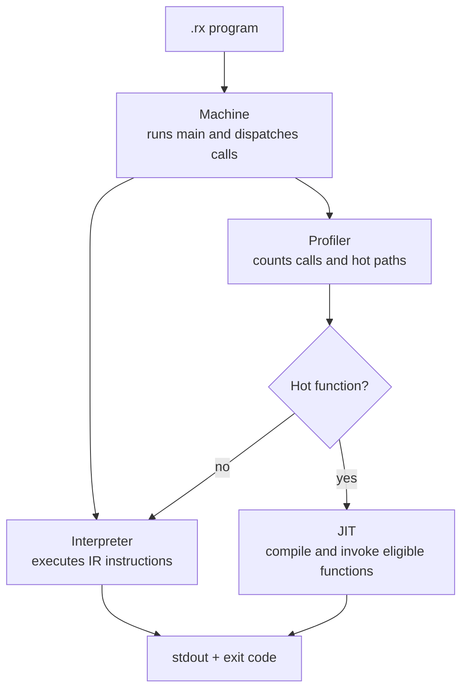

# RVM JIT Report

## RVM structure

## Current Optimizations

The current optimization strategy is profiler-guided selective JIT compilation. The interpreter records function calls, executed instructions, loop back edges, and basic-block edge frequencies. Once a function becomes hot, RVM compiles only the eligible closed call graph for that function, caches the generated RISC-V objects and entry executable under `.rvm-cache`, and reuses them on later calls. Before code generation, recorded branch frequencies are also used to reorder basic blocks so that hotter successors are placed closer to their predecessors,  which improves the cached JIT path by reducing repeated compilation cost and favoring fall-through execution on common control-flow paths.

## JIT Compilation Flow

When the interpreter reaches a hot function, `JitManager` checks whether the function and its closed call graph are eligible for JIT. It builds an entry ABI, compiles each required IR function into a RISC-V object file, generates a wrapper for argument passing and result write-back, and links everything into a cached `root.elf`. The ELF is then executed through `qemu-riscv64`; if any step fails, RVM falls back to the interpreter.

## RVM JIT Benchmark Report

This report summarizes the full candidate suite selected from `benchmarks/results/discovery-full/benchmark-candidates.csv`. The suite contains
all 17 benchmarks that passed correctness checks, produced JIT artifacts, and showed positive cached JIT speedup in discovery.

### Overall Results

| Metric | Cold JIT | Cached JIT |
| --- | ---: | ---: |
| Geomean speedup | 1.36x | 2.88x |
| Median speedup | 1.95x | 2.79x |
| Arithmetic mean speedup | 1.85x | 3.40x |
| Total-time speedup | 3.13x | 4.69x |

Total median time across the 17 selected benchmarks:

| Mode | Total time |
| --- | ---: |
| Interpreter | 104.93s |
| Cold JIT | 33.57s |
| Cached JIT | 22.35s |

## Candidate Benchmarks

| Rank | Benchmark | Interpreter ms | Cold JIT ms | Cached JIT ms | Cold speedup | Cached speedup | Artifacts |
| ---: | --- | ---: | ---: | ---: | ---: | ---: | ---: |
| 1 | `semantic-2/comprehensive27` | 2548.644 | 1248.100 | 355.083 | 2.042x | 7.178x | 161 |
| 2 | `semantic-2/comprehensive7` | 3198.253 | 1403.742 | 460.391 | 2.278x | 6.947x | 144 |
| 3 | `jit_call_chain` | 2800.093 | 668.042 | 487.807 | 4.191x | 5.740x | 13 |
| 4 | `semantic-2/comprehensive22` | 2533.644 | 1553.564 | 463.769 | 1.631x | 5.463x | 184 |
| 5 | `semantic-2/comprehensive21` | 81445.502 | 15740.486 | 15161.983 | 5.174x | 5.372x | 113 |
| 6 | `semantic-2/comprehensive6` | 1933.156 | 1622.259 | 483.184 | 1.192x | 4.001x | 185 |
| 7 | `hot_branch_layout` | 1146.149 | 451.339 | 373.978 | 2.539x | 3.065x | 7 |
| 8 | `hot_scalar_loop` | 1142.961 | 469.980 | 390.770 | 2.432x | 2.925x | 7 |
| 9 | `jit_arithmetic_kernel` | 1313.652 | 530.681 | 470.187 | 2.475x | 2.794x | 7 |
| 10 | `hot_branch_layout_warmup` | 1013.400 | 425.352 | 368.036 | 2.382x | 2.754x | 7 |
| 11 | `jit_branch_kernel` | 1046.674 | 535.543 | 438.519 | 1.954x | 2.387x | 7 |
| 12 | `semantic-2/comprehensive28` | 2090.661 | 2135.655 | 993.001 | 0.979x | 2.105x | 178 |
| 13 | `semantic-2/comprehensive2` | 688.187 | 1602.974 | 378.012 | 0.429x | 1.821x | 239 |
| 14 | `semantic-2/comprehensive3` | 589.932 | 1705.311 | 393.773 | 0.346x | 1.498x | 246 |
| 15 | `semantic-2/comprehensive35` | 325.372 | 507.028 | 249.376 | 0.642x | 1.305x | 31 |
| 16 | `semantic-2/comprehensive5` | 549.552 | 1465.153 | 424.750 | 0.375x | 1.294x | 167 |
| 17 | `semantic-2/comprehensive4` | 565.954 | 1505.989 | 458.503 | 0.376x | 1.234x | 194 |
